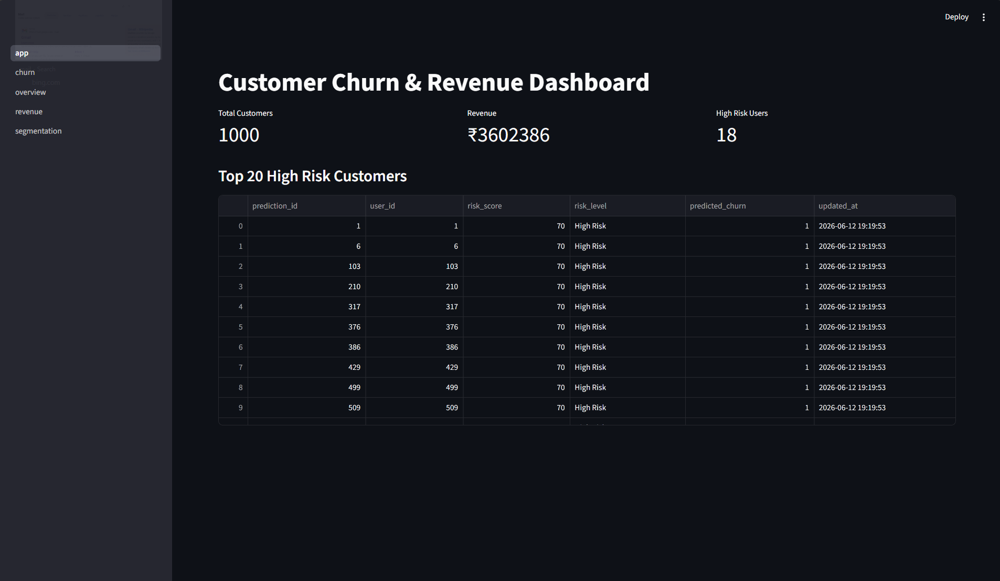
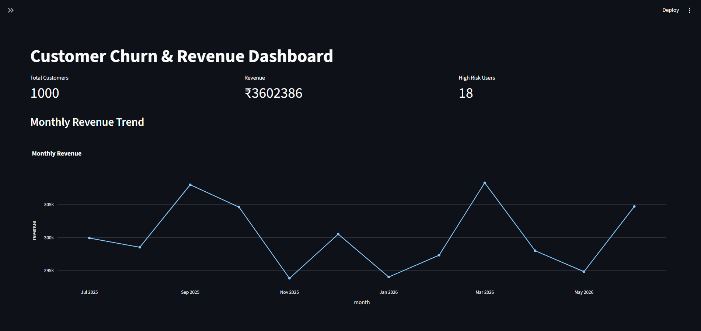

# Automated Customer Churn & Revenue Analytics Dashboard

## Overview

Customer churn is one of the most important business metrics for subscription-based companies. Losing existing customers directly impacts revenue and growth. This project was developed to analyze customer behavior, identify churn risks, monitor revenue trends, and provide business insights through an interactive analytics dashboard.

The application simulates a real-world analytics workflow by generating customer, payment, and usage data, storing it in a relational database, performing analytics using SQL and Python, and visualizing the results through a Streamlit dashboard.

---

## Project Objectives

* Analyze customer subscription and usage behavior
* Identify customers at risk of churning
* Track revenue performance over time
* Segment customers based on risk levels
* Build an interactive dashboard for business decision-making
* Demonstrate end-to-end data analytics skills

---

## Features

### Customer Analytics

* Customer database management
* Customer segmentation
* Risk classification

### Revenue Analytics

* Monthly revenue tracking
* Revenue trend visualization
* Top revenue-generating customers
* Revenue ranking using SQL Window Functions

### Churn Analytics

* Churn risk scoring system
* High Risk, Medium Risk, and Safe customer categorization
* Churn distribution visualization
* High-risk customer identification

### Interactive Dashboard

* KPI cards
* Revenue trend charts
* Churn distribution charts
* Region-based filtering
* Subscription-based filtering
* Downloadable CSV reports

---

## Technology Stack

### Programming Languages

* Python
* SQL

### Libraries & Frameworks

* Pandas
* Plotly
* Streamlit
* Faker

### Database

* SQLite

### Tools

* Git
* GitHub
* VS Code

---

## Database Design

The project uses a relational database with four primary tables:

### Users

Stores customer information.

Fields:

* user_id
* full_name
* region
* signup_date
* subscription_type
* status

### Payments

Stores subscription payment history.

Fields:

* payment_id
* user_id
* payment_date
* amount
* payment_status

### Usage Logs

Stores customer activity data.

Fields:

* usage_id
* user_id
* usage_date
* sessions
* minutes_spent

### Churn Predictions

Stores churn risk analysis results.

Fields:

* prediction_id
* user_id
* risk_score
* risk_level
* predicted_churn

---

## Analytics Workflow

Raw Customer Data
→ Data Generation
→ SQLite Database
→ SQL Analytics
→ Churn Scoring
→ Dashboard Visualization

---

## SQL Concepts Used

This project demonstrates several SQL concepts including:

* SELECT
* GROUP BY
* JOIN
* Aggregations
* Window Functions

Window Functions Used:

### RANK()

Used to identify top revenue-generating customers.

### LAG()

Used for month-over-month revenue trend analysis.

---

## Churn Scoring Logic

Customers are assigned a risk score based on:

* Average application usage
* Session frequency
* Payment failure history

Risk Categories:

| Risk Level  | Description                   |
| ----------- | ----------------------------- |
| Safe        | Low probability of churn      |
| Medium Risk | Moderate probability of churn |
| High Risk   | High probability of churn     |

---

## Dashboard Components

### KPI Metrics

* Total Customers
* Total Revenue
* High Risk Customers

### Charts

* Monthly Revenue Trend
* Churn Risk Distribution

### Tables

* Top High-Risk Customers
* Top Revenue Customers

### Filters

* Region
* Subscription Type

---

## Skills Demonstrated

### Data Analytics

* Data Cleaning
* Data Transformation
* KPI Development
* Customer Analytics
* Revenue Analytics

### Database

* Relational Database Design
* SQL Querying
* Window Functions

### Visualization

* Interactive Dashboards
* Business Reporting
* Data Visualization

### Programming

* Python
* Pandas
* Streamlit

---

## Installation

Clone the repository:

```bash
git clone <repository-url>
```

Move into the project folder:

```bash
cd customer-churn-dashboard
```

Create a virtual environment:

```bash
python -m venv venv
```

Activate the environment:

Windows:

```bash
venv\Scripts\activate
```

Install dependencies:

```bash
pip install -r requirements.txt
```

---

## Running the Project

Create the database:

```bash
python database/create_db.py
```

Generate sample customer data:

```bash
python src/generate_sample_data.py
```

Load customers:

```bash
python src/load_customers.py
```

Generate business activity data:

```bash
python src/generate_business_data.py
```

Generate churn predictions:

```bash
python src/churn_scoring.py
```

Launch the dashboard:

```bash
streamlit run dashboard/app.py
```

---

## Future Improvements

* Machine Learning Churn Prediction
* Random Forest and Logistic Regression Models
* PostgreSQL Integration
* Power BI Dashboard Version
* Streamlit Cloud Deployment
* Real-Time Data Pipeline
* User Authentication

---

## Author

Developed as a Data Analytics and Data Science portfolio project to demonstrate practical skills in Python, SQL, Data Visualization, Business Analytics, and Dashboard Development.

# Automated Customer Churn & Revenue Analytics Dashboard

### Live Application
https://customer-churn-revenue-dashboard.streamlit.app

### Source Code
https://github.com/Azhaar07/customer-churn-revenue-dashboard

## Dashboard Preview





.png)
